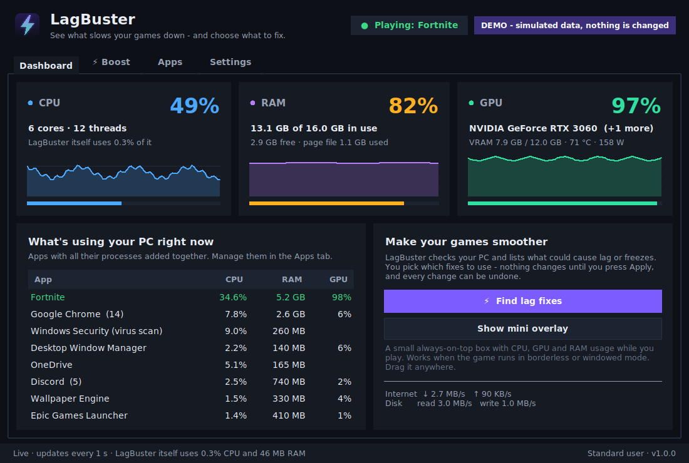
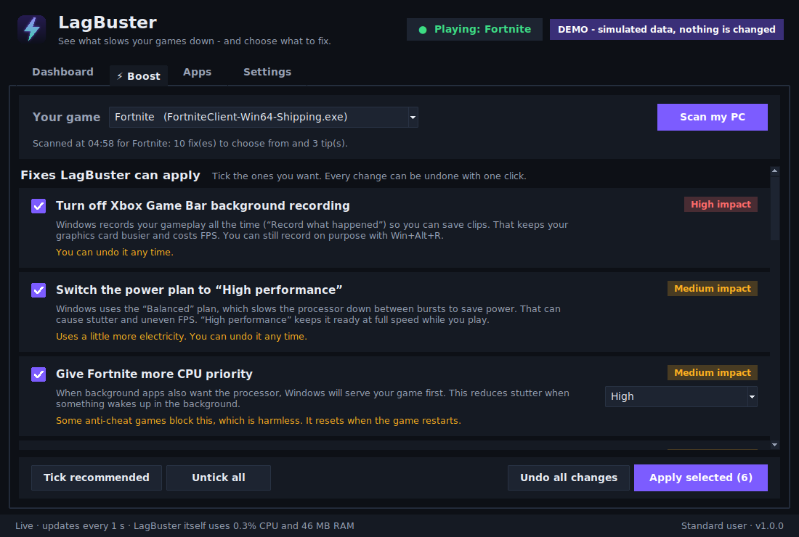
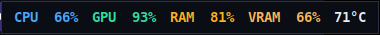

# ⚡ LagBuster

**See what's slowing your games down, then pick what to fix.**

LagBuster is a small Windows app that shows your **CPU, RAM and graphics card (GPU)** usage live. It
also checks your PC for the usual causes of lag, stutter and freezes while gaming. It gives
you a list of suggested fixes with checkboxes. **You choose** which ones to apply, nothing changes until
you press **Apply**, and **Undo all changes** puts everything back.





Mini overlay for while you play (stays on top of games in borderless/windowed mode):



---

## Get it

### Option 1: download the ready-made `LagBuster.exe` (easiest)

1. Open this repository on GitHub and click the **Actions** tab.
2. Click the latest green ✅ **LagBuster** run.
3. At the bottom, under **Artifacts**, download **LagBuster-windows** and unzip it.
4. Double-click **LagBuster.exe**.
   Windows may say *"Windows protected your PC"* because the app isn't code-signed.
   Click **More info → Run anyway**.

### Option 2: run it from the source code

1. Install **Python 3.10 or newer** from [python.org](https://www.python.org/downloads/) and tick
   **"Add python.exe to PATH"** during setup.
2. Double-click **`run_lagbuster.bat`** in this folder. The first time, it installs the two things
   LagBuster needs (`psutil` and `nvidia-ml-py`), then starts the app.

Want to look around first without changing anything? Run `python -m lagbuster --demo` to open it with
made-up numbers.

---

## How to use it

1. **Start your game**, then Alt+Tab to LagBuster. It detects most games automatically (you can
   also pick your game in the list).
2. Open the **⚡ Boost** tab and press **Scan my PC**. It measures for a few seconds.
3. Read the list and **tick what you want**. Recommended fixes are ticked for you. For background
   apps you can choose **"Close it"** or **"Lower its priority"** (the app keeps running, your game
   just goes first).
4. Press **Apply selected**. LagBuster shows what worked, then scans again.
5. Done playing? Press **Undo all changes** to put everything back.

LagBuster remembers what you ticked and unticked, so next time your choices are already set.

## What it can fix

| Suggestion | What it does | Undo? |
|---|---|---|
| **Power plan → High performance** (or power mode → Best performance) | Stops Windows from slowing the processor down between bursts, a common cause of stutter | ✅ |
| **Turn off Xbox Game Bar background recording** | Windows stops recording your gameplay non-stop ("Record what happened"), which frees up the GPU | ✅ |
| **Turn Windows Game Mode back on** | Only suggested if it was switched off | ✅ |
| **Give your game more CPU priority** | Windows serves your game first when background apps also want the CPU | ✅ (also resets when the game restarts) |
| **Close background apps** (Chrome, Discord, OneDrive, Wallpaper Engine, launchers…) | Frees RAM, CPU and GPU. Apps that might hold unsaved work are only *asked* to close, never force-closed | – |
| **Lower background apps' priority** | Gentler than closing: the app keeps working (e.g. Discord voice chat, Spotify) | ✅ |
| **Free up RAM held by background apps** | When RAM is nearly full, asks background apps to give back memory they aren't using. Nothing is closed | – |

It also gives **tips** for things only you can change:

- running on **battery**
- graphics card **overheating** or **out of video memory (VRAM)**
- game running on the slow **built-in graphics** instead of the real graphics card
- **processor maxed out**
- **Windows Security scan** or **Windows Update** busy in the background
- **internet hogs** and an **unstable connection** (lag spikes online)
- a nearly **full C: drive**
- **virtual memory turned off**
- too many **startup apps**

## Safety

- **Nothing happens without your OK.** Every change is listed and has to be ticked.
- **Undo works even after a restart** of LagBuster. Changes are saved in an undo list.
- **Never touches** Windows system processes, graphics/audio drivers, or anti-cheat software
  (Easy Anti-Cheat, BattlEye, Vanguard, FACEIT…). It also leaves alone the launcher that started your game.
- **Anti-cheat friendly:** it doesn't read or change game memory, inject anything, or modify game
  files. It only uses normal Windows settings, the same way Task Manager and the Settings app do.
- **Light on your PC:** LagBuster shows its own CPU/RAM use in the status bar. Per-app measuring
  pauses while its window is minimized.
- No admin rights needed for normal use.

## FAQ

**Will this double my FPS?** No app can honestly promise that. LagBuster goes after the real, common
causes of lag and freezes: RAM running out, background apps, power saving, background recording,
overheating, full VRAM and internet hogs. On a PC with those problems the difference can be big. On a
PC that's already clean, it will say so.

**Is it safe with Fortnite / Valorant / other anti-cheat games?** Yes. See *Safety* above. Some
anti-cheat systems block changing the game's priority. LagBuster then says so and moves on.

**Why is GPU temperature missing?** Windows reports GPU temperature through the graphics driver.
LagBuster can read it for **NVIDIA** cards. For AMD/Intel it shows load and memory only.

**The overlay doesn't show in my game.** Set the game to **Borderless** or **Windowed** mode. No normal
app can draw over exclusive full-screen games.

**Where are its files?** Settings, the undo list and a log file are in `%APPDATA%\LagBuster`
(Settings → *Open data folder*).

It also works on Linux (monitoring, closing apps, priorities, power profiles). The Windows-only
fixes are simply not offered there.

---

## For developers

```
python -m pip install -r requirements.txt pytest
python -m pytest -q                         # unit + UI tests (UI tests need a display)
python -m lagbuster --selftest              # checks every Windows API the app uses, changes nothing
python -m lagbuster --demo                  # simulated data, dry-run actions
```

| Module | Job |
|---|---|
| `monitor.py` | background sampler: CPU, RAM, disk, network, per-app CPU/RAM/GPU |
| `gpu.py` | GPU data: Windows performance counters + DXGI (any brand), NVIDIA NVML / `nvidia-smi`, AMD sysfs on Linux |
| `probe.py` | reads power plan, Game Bar/Game Mode, startup apps, disk, network latency |
| `advisor.py` | pure rules that turn measurements into suggestions |
| `actions.py` | the changes (each reversible one is written to the undo journal) |
| `apps.py` | known apps, protected processes and game detection |
| `winapi.py` | ctypes wrappers (PDH, DXGI, WM_CLOSE, EmptyWorkingSet, power mode, registry) |
| `ui/` | Tkinter interface |

CI (`.github/workflows/lagbuster.yml`) runs the tests on Windows and Linux, runs `--selftest` on real
Windows, and builds `LagBuster.exe` with PyInstaller.
